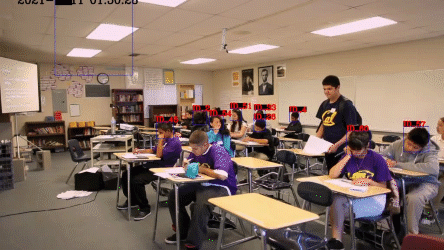

# A C++ implementation of Yolov5 and Deepsort in Jetson Xavier nx and Jetson nano
[](https://opensource.org/licenses/MIT)
[](https://github.com/RichardoMrMu/yolov5-deepsort-tensorrt)

This repository uses yolov5 and deepsort to follow humna heads which can run in Jetson Xavier nx and Jetson nano. 
In Jetson Xavier Nx, it can achieve 10 FPS when images contain heads about 70+(you can try python version, when you use python version, you can find it very slow in Jetson Xavier nx , and Deepsort can cost nearly 1s).



Thanks for [B.Q Long](https://github.com/lbq779660843), offer the windows cmakelists.txt. If you want run this rep in windows, you can use [CMakeLists_deepsort-tensorrt_win10.txt](https://github.com/RichardoMrMu/yolov5-deepsort-tensorrt/blob/main/CMakeLists_deepsort-tensorrt_win10.txt) and [CMakeLists_yolov5-deepsort-tensorrt_win10.txt](https://github.com/RichardoMrMu/yolov5-deepsort-tensorrt/blob/main/CMakeLists_yolov5-deepsort-tensorrt_win10.txt). 

You can see video play in [BILIBILI](https://www.bilibili.com/video/BV1nR4y1H7sR/), or [YOUTUBE](https://www.youtube.com/watch?v=29vEi-7mEic) and [YOUTUBE](https://youtu.be/mVq3pWNjb3E).

## Requirement
1. Jetson nano or Jetson Xavier nx
2. Jetpack 4.5.1
3. python3 with default(jetson nano or jetson xavier nx has default python3 with tensorrt 7.1.3.0 )
4. tensorrt 7.1.3.0
5. torch 1.8.0
6. torchvision 0.9.0
7. torch2trt 0.3.0
8. onnx 1.4.1
9. opencv-python 4.5.3.56
10. protobuf 3.17.3
11. scipy 1.5.4


if you have problem in this project, you can see this [artical](https://blog.csdn.net/weixin_42264234/article/details/120152117).

## Comming soon
- [ ] Int8 .
- [ ] IOU Tracking.
- [ ] Faster and use less memory.
## Speed

Whole process time from read image to finished deepsort (include every img preprocess and postprocess)
and attention!!! the number of deepsort tracking is 70+, not single or 10-20 persons, is 70+. And all results can get in Jetson Xavier nx.
| Backbone        | before TensorRT without tracking |before TensorRT with tracking |TensortRT(detection)| TensorRT(detection + tracking) | FPS(detection + tracking) |
| :-------------- | --------------- | ------------------ |--------------|------------------------------ | ------------------------- |
| Yolov5s_416      | 100ms           | 0.9s|10-15ms|100-150ms                          | 8 ~ 9                   |
| Yolov5s-640 | 120ms             | 1s|18-20ms|100-150ms                      | 8 ~ 9                     |

------

## Build and Run

```shell
git clone https://github.com/RichardoMrMu/yolov5-deepsort-tensorrt.git
cd yolov5-deepsort-tensorrt
// before you cmake and make, please change ./src/main.cpp char* yolo_engine = ""; char* sort_engine = ""; to your own path
mkdir build 
cmake ..
make 
```
if you meet some errors in cmake and make, please see this [artical](https://blog.csdn.net/weixin_42264234/article/details/120152117) or see Attention.

## DataSet
If you need to train your own model with head detection, you can use this [SCUT-HEAD](https://github.com/HCIILAB/SCUT-HEAD-Dataset-Release), this dataset has bbox with head and can download freely.

## Model
You need two model, one is yolov5 model, for detection, generating from [tensorrtx](https://github.com/wang-xinyu/tensorrtx). And the other is deepsort model, for tracking. You should generate the model the same way.
### Generate yolov5 model
For yolov5 detection model, I choose yolov5s, and choose `yolov5s.pt->yolov5s.wts->yolov5s.engine`
Note that, used models can get from [yolov5](https://github.com/ultralytics/yolov5) and [deepsort](https://github.com/ZQPei/deep_sort_pytorch), and if you need to use your own model, you can follow the `Run Your Custom Model`.
You can also see [tensorrtx official readme](https://github.com/wang-xinyu/tensorrtx/tree/master/yolov5)
The following is deepsort.onnx and deesort.engine files, you can find in baiduyun and [https://github.com/RichardoMrMu/yolov5-deepsort-tensorrt/releases/tag/yolosort](https://github.com/RichardoMrMu/yolov5-deepsort-tensorrt/releases/tag/yolosort)
| Model| Url |
| :-------------- | --------------- |
| 百度云 | [BaiduYun url](https://pan.baidu.com/s/1vpQFsD346lP64O1nhOilkw ) passwd:`z68e`| 

1. Get yolov5 repository


Note that, here uses the official pertained model.And I use yolov5-5, v5.0. So if you train your own model, please be sure your yolov5 code is v5.0.

```shell
git clone -b v5.0 https://github.com/ultralytics/yolov5.git
cd yolov5
mkdir weights
cd weights
// download https://github.com/ultralytics/yolov5/releases/download/v5.0/yolov5s.pt
wget https://github.com/ultralytics/yolov5/releases/download/v5.0/yolov5s.pt

```

2. Get tensorrtx.

For yolov5 v5.0, download .pt from [yolov5 release v5.0](https://github.com/ultralytics/yolov5/releases/tag/v5.0), `git clone -b v5.0 https://github.com/ultralytics/yolov5.git` and `git clone -b yolov5-v5.0 https://github.com/wang-xinyu/tensorrtx.git`, then follow how-to-run in [tensorrtx/yolov5-v5.0](https://github.com/wang-xinyu/tensorrtx/tree/yolov5-v5.0/yolov5).


3. Get xxx.wst model

```shell
cp {tensorrtx}/yolov5/gen_wts.py {ultralytics}/yolov5/
cd yolov5 
python3 gen_wts.py -w ./weights/yolov5s.pt -o ./weights/yolov5s.wts
// a file 'yolov5s.wts' will be generated.
```
You can get yolov5s.wts model in `yolov5/weights/`

4. Build tensorrtx/yolov5 and get tensorrt engine

```shell 
cd tensorrtx/yolov5
// update CLASS_NUM in yololayer.h if your model is trained on custom dataset
mkdir build
cd build
cp {ultralytics}/yolov5/yolov5s.wts {tensorrtx}/yolov5/build
cmake ..
make
// yolov5s
sudo ./yolov5 -s yolov5s.wts yolov5s.engine s
// test your engine file
sudo ./yolov5 -d yolov5s.engine ../samples
```
Then you get the yolov5s.engine, and you can put `yolov5s.engine` in My project. For example

```shell
cd {yolov5-deepsort-tensorrt}
mkdir resources
cp {tensorrtx}/yolov5/build/yolov5s.engine {yolov5-deepsort-tensorrt}/resources
```

5. Get deepsort engine file
You can get deepsort pretrained model in this [drive url](https://drive.google.com/drive/folders/1xhG0kRH1EX5B9_Iz8gQJb7UNnn_riXi6)
and ckpt.t7 is ok.
```shell
git clone https://github.com/RichardoMrMu/deepsort-tensorrt.git
// 根据github的说明
cp {deepsort-tensorrt}/exportOnnx.py {deep_sort_pytorch}/
python3 exportOnnx.py
mv {deep_sort_pytorch}/deepsort.onnx {deepsort-tensorrt}/resources
cd {deepsort-tensorrt}
mkdir build
cd build
cmake ..
make 
./onnx2engine ../resources/deepsort.onnx ../resources/deepsort.engine
// test
./demo ../resource/deepsort.engine ../resources/track.txt
```
After all 5 step, you can get the yolov5s.engine and deepsort.engine.

You may face some problems in getting yolov5s.engine and deepsort.engine, you can upload your issue in github or [csdn artical](https://blog.csdn.net/weixin_42264234/article/details/120152117).
<details>
<summary>Different versions of yolov5</summary>

Currently, tensorrt support yolov5 v1.0(yolov5s only), v2.0, v3.0, v3.1, v4.0 and v5.0.

- For yolov5 v5.0, download .pt from [yolov5 release v5.0](https://github.com/ultralytics/yolov5/releases/tag/v5.0), `git clone -b v5.0 https://github.com/ultralytics/yolov5.git` and `git clone https://github.com/wang-xinyu/tensorrtx.git`, then follow how-to-run in current page.
- For yolov5 v4.0, download .pt from [yolov5 release v4.0](https://github.com/ultralytics/yolov5/releases/tag/v4.0), `git clone -b v4.0 https://github.com/ultralytics/yolov5.git` and `git clone -b yolov5-v4.0 https://github.com/wang-xinyu/tensorrtx.git`, then follow how-to-run in [tensorrtx/yolov5-v4.0](https://github.com/wang-xinyu/tensorrtx/tree/yolov5-v4.0/yolov5).
- For yolov5 v3.1, download .pt from [yolov5 release v3.1](https://github.com/ultralytics/yolov5/releases/tag/v3.1), `git clone -b v3.1 https://github.com/ultralytics/yolov5.git` and `git clone -b yolov5-v3.1 https://github.com/wang-xinyu/tensorrtx.git`, then follow how-to-run in [tensorrtx/yolov5-v3.1](https://github.com/wang-xinyu/tensorrtx/tree/yolov5-v3.1/yolov5).
- For yolov5 v3.0, download .pt from [yolov5 release v3.0](https://github.com/ultralytics/yolov5/releases/tag/v3.0), `git clone -b v3.0 https://github.com/ultralytics/yolov5.git` and `git clone -b yolov5-v3.0 https://github.com/wang-xinyu/tensorrtx.git`, then follow how-to-run in [tensorrtx/yolov5-v3.0](https://github.com/wang-xinyu/tensorrtx/tree/yolov5-v3.0/yolov5).
- For yolov5 v2.0, download .pt from [yolov5 release v2.0](https://github.com/ultralytics/yolov5/releases/tag/v2.0), `git clone -b v2.0 https://github.com/ultralytics/yolov5.git` and `git clone -b yolov5-v2.0 https://github.com/wang-xinyu/tensorrtx.git`, then follow how-to-run in [tensorrtx/yolov5-v2.0](https://github.com/wang-xinyu/tensorrtx/tree/yolov5-v2.0/yolov5).
- For yolov5 v1.0, download .pt from [yolov5 release v1.0](https://github.com/ultralytics/yolov5/releases/tag/v1.0), `git clone -b v1.0 https://github.com/ultralytics/yolov5.git` and `git clone -b yolov5-v1.0 https://github.com/wang-xinyu/tensorrtx.git`, then follow how-to-run in [tensorrtx/yolov5-v1.0](https://github.com/wang-xinyu/tensorrtx/tree/yolov5-v1.0/yolov5).
</details>

<details>

<summary>Config</summary>

- Choose the model s/m/l/x/s6/m6/l6/x6 from command line arguments.
- Input shape defined in yololayer.h
- Number of classes defined in yololayer.h, **DO NOT FORGET TO ADAPT THIS, If using your own model**
- INT8/FP16/FP32 can be selected by the macro in yolov5.cpp, **INT8 need more steps, pls follow `How to Run` first and then go the `INT8 Quantization` below**
- GPU id can be selected by the macro in yolov5.cpp
- NMS thresh in yolov5.cpp
- BBox confidence thresh in yolov5.cpp
- Batch size in yolov5.cpp
</details>

## Run Your Custom Model
You may need train your own model and transfer your trained-model to tensorRT. So you can follow the following steps.
1. Train Custom Model
You can follow the [official wiki](https://github.com/ultralytics/yolov5/wiki/Train-Custom-Data
) to train your own model on your dataset. For example, I choose yolov5-s to train my model.
2. Transfer Custom Model
Just like [tensorRT official guideline](https://github.com/wang-xinyu/tensorrtx/edit/master/yolov5/).When your follow ` Generate yolov5 model` to get yolov5 and tensorrt rep, next step is to transfer your pytorch model to tensorrt.
Before this, you need to change yololayer.h file 20,21 and 22 line(CLASS_NUM，INPUT_H,INPUT_W) to your own parameters.

```shell
// before 
static constexpr int CLASS_NUM = 80; // 20
static constexpr int INPUT_H = 640;  // 21  yolov5's input height and width must be divisible by 32.
static constexpr int INPUT_W = 640; // 22

// after 
// if your model is 2 classfication and image size is 416*416
static constexpr int CLASS_NUM = 2; // 20
static constexpr int INPUT_H = 416;  // 21  yolov5's input height and width must be divisible by 32.
static constexpr int INPUT_W = 416; // 22
```

```shell
cd {tensorrtx}/yolov5/
// update CLASS_NUM in yololayer.h if your model is trained on custom dataset

mkdir build
cd build
cp {ultralytics}/yolov5/yolov5s.wts {tensorrtx}/yolov5/build
cmake ..
make
sudo ./yolov5 -s [.wts] [.engine] [s/m/l/x/s6/m6/l6/x6 or c/c6 gd gw]  // serialize model to plan file
sudo ./yolov5 -d [.engine] [image folder]  // deserialize and run inference, the images in [image folder] will be processed.
// For example yolov5s
sudo ./yolov5 -s yolov5s.wts yolov5s.engine s
sudo ./yolov5 -d yolov5s.engine ../samples
// For example Custom model with depth_multiple=0.17, width_multiple=0.25 in yolov5.yaml
sudo ./yolov5 -s yolov5_custom.wts yolov5.engine c 0.17 0.25
sudo ./yolov5 -d yolov5.engine ../samples
```

In this way, you can get your own tensorrt yolov5 model. Enjoy it!

# Other Project
- [yolov5-deepsort-tensorrt](https://github.com/RichardoMrMu/yolov5-deepsort-tensorrt)
- [facial-emotion-recognition](https://github.com/RichardoMrMu/facial-emotion-recognition)
- [yolov5-fire-smoke-detect-python](https://github.com/RichardoMrMu/yolov5-fire-smoke-detect-python)
- [yolov5-helmet-detection](https://github.com/RichardoMrMu/yolov5-helmet-detection)
- [yolov5-fire-smoke-detect](https://github.com/RichardoMrMu/yolov5-fire-smoke-detect)
- [gazecapture-web gaze estimation](https://github.com/RichardoMrMu/gazecapture-web)
- [yolov5-helmet-detection-python](https://github.com/RichardoMrMu/yolov5-helmet-detection-python)
- [yolov5-reflective-clothes-detect-python](https://github.com/RichardoMrMu/yolov5-reflective-clothes-detect-python)
- [yolov5-reflective-clothes-detect](https://github.com/RichardoMrMu/yolov5-reflective-clothes-detect)
- [yolov5-smoking-detect](https://github.com/RichardoMrMu/yolov5-smoking-detect)
- [yolov5-mask-detect](https://github.com/RichardoMrMu/yolov5-mask-detect)
- [yolov5-mask-detection-python](https://github.com/RichardoMrMu/yolov5-mask-detection-python)
- [yolov5-smoke-detection-python](https://github.com/RichardoMrMu/yolov5-smoke-detection-python)
- [deepsort-tensorrt](https://github.com/RichardoMrMu/deepsort-tensorrt)


